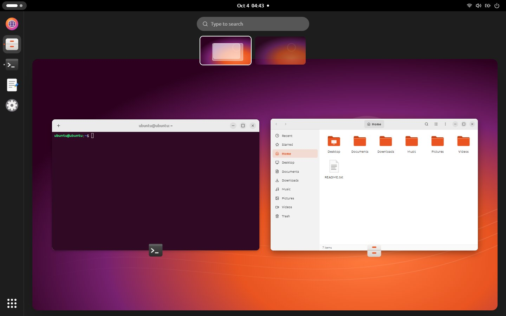
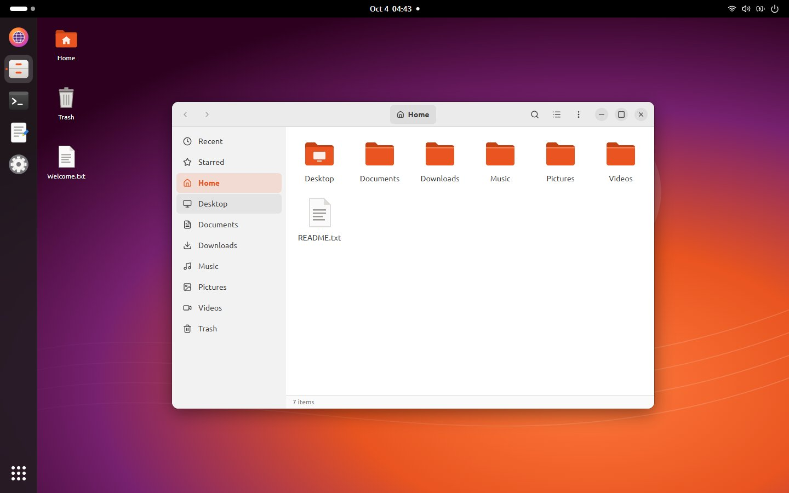
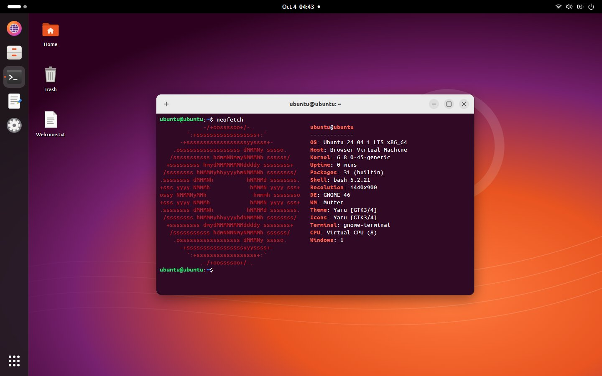
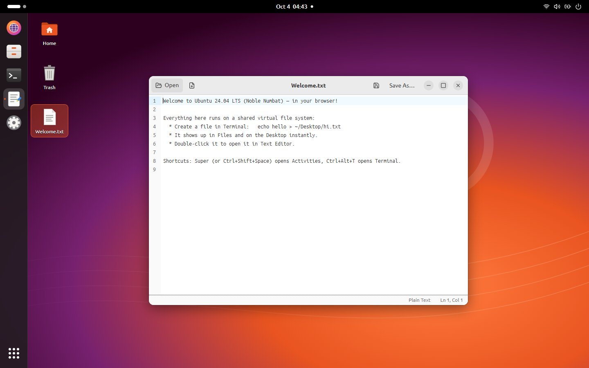
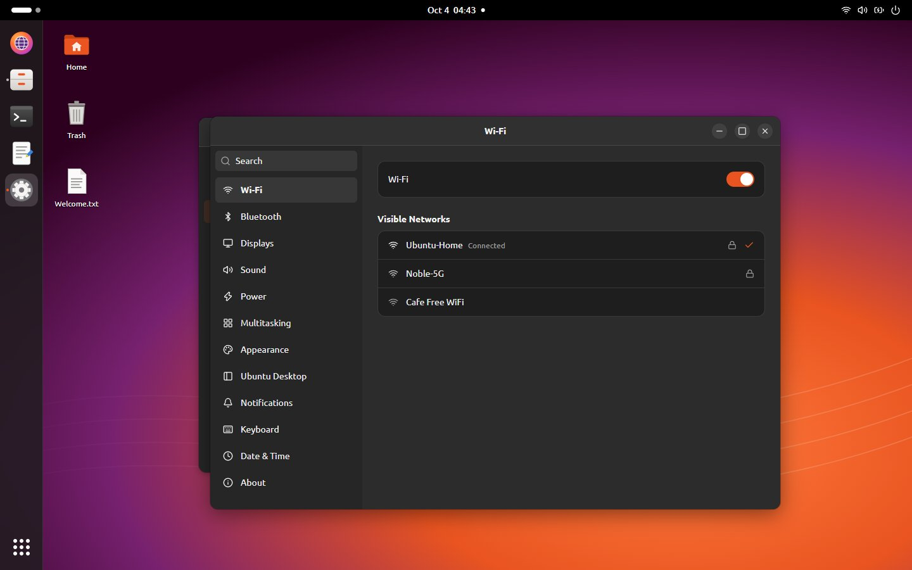
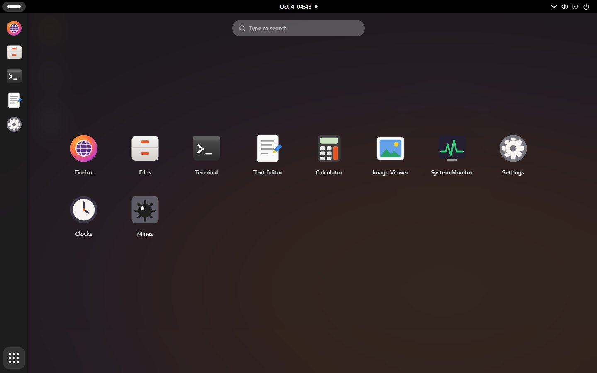
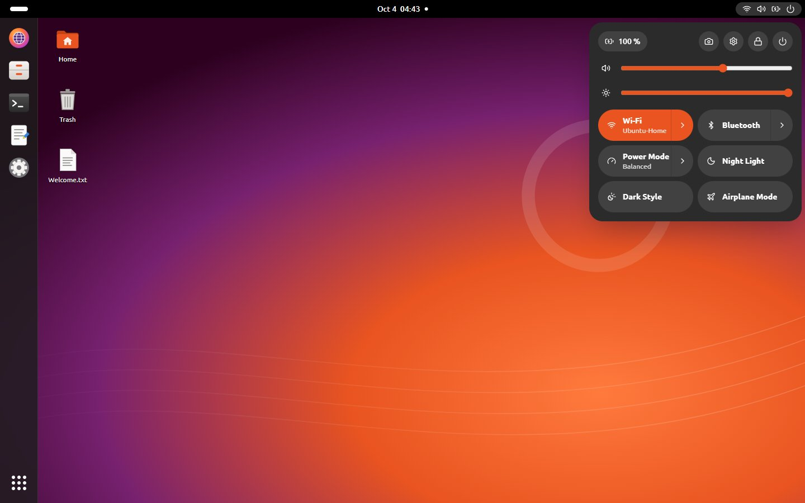

# React ile Ubuntu 24.04

Ubuntu 24.04 LTS masaüstünün (GNOME 46, Yaru, Ubuntu Dock) tarayıcıda çalışan bir kopyası. Her uygulama gerçekten
çalışır ve hepsi aynı sanal dosya sistemini paylaşır: Terminal'de oluşturduğun dosya Files'ta anında görünür, orada
çift tıklayınca Text Editor'de açılır, kaydedince `cat` yeni içeriği gösterir.

Backend yok: her şey tarayıcıda çalışır ve `localStorage`'a kaydedilir.



|                                                                                                          |                                                                                                                         |
| -------------------------------------------------------------------------------------------------------- | ----------------------------------------------------------------------------------------------------------------------- |
|  **Files**: breadcrumb, arama, dikdörtgen seçim, sürükle-bırak            |  **Terminal**: ortak dosya sistemi üzerinde bash benzeri kabuk |
|  **Text Editor**: sekmeli ve sözdizimi renklendirmeli CodeMirror 6 |  **Settings**: 12 panel, koyu tema, duvar kâğıtları, dock seçenekleri      |
|  Aramalı **App Grid**                                                   |  Alt menülü **Quick Settings**                                                  |

## Hızlı başlangıç

### Docker Compose

```bash
echo "SITE_URL=https://ubuntu.example.com" > .env   # isteğe bağlı, aşağıya bak
docker compose up -d --build
# http://localhost:8080 adresini aç ve herhangi bir parolayla giriş yap
```

| `.env` değişkeni | Varsayılan | Amaç                                                                                                                        |
| ---------------- | ---------- | --------------------------------------------------------------------------------------------------------------------------- |
| `SITE_URL`       | boş        | Build sırasında gömülen genel URL; link önizlemeleri mutlak görsel URL'si alır (Facebook, LinkedIn, X ve Slack bunu ister). |
| `PORT`           | `8080`     | Sunucudaki port.                                                                                                            |

Container uygulamayı yalnızca düz HTTP ile sunar. Alan adı ve TLS için önüne bir reverse proxy koy.
**Nginx Proxy Manager** ile sunucunun IP'sine ve `PORT`'a (NPM aynı Docker ağındaysa `ubuntu-react:8080`'e)
yönlendiren bir Proxy Host ekle ve SSL sertifikasını orada al.

İmaj iki aşamalıdır: Bun bundle'ı derler, aynı Bun imajı da `server.ts`'yi `node_modules` olmadan, root olmayan
`bun` kullanıcısıyla çalıştırır. `HEALTHCHECK` tanımlıdır.

### Yerel geliştirme

Bun ≥ 1.3 gerekir.

```bash
bun install
bun dev              # HMR'li geliştirme sunucusu (bun ./index.html)
bun test             # birim + happy-dom bileşen testleri
bun run typecheck
bun run build        # dist/ içine production bundle (mutlak sosyal URL'ler için SITE_URL=…)
bun run e2e          # gerçek Chrome'da uçtan uca senaryo (`bun dev` açık olmalı)
bun run e2e:mouse    # masaüstü ikonu ve pencere başlık çubuğu fare kontrolleri (başka sunucu için URL=…)
bun run shots        # her sahnenin ekran görüntüsünü e2e/shots/ içine kaydeder
```

`e2e`, `e2e:mouse` ve `shots`, kurulu Google Chrome'u `playwright-core` ile sürer (tarayıcı indirmez).
README görselleri de aynı betikten gelir:

```bash
DIR=docs/screenshots EXT=jpg bun e2e/shot.ts overview files terminal editor dark grid quick
SIZE=1200x630 DIR=public bun e2e/shot.ts overview && mv public/overview.png public/og.png
```

## Performans ve sunum

- **Fontlar:** Bun'ın CSS bundler'ı her `url()`'i base64 olarak gömer. `build.ts` woff2 fontları tekrar ayrı
  dosyalara çıkarır; böylece tarayıcı `unicode-range` sayesinde yalnızca sayfanın kullandığı alt kümeleri indirir.
  woff yedekleri atılır.
- **Kod bölme:** her uygulama `lazy()` ile yüklenir. CodeMirror (≈670 KB) ve xterm (≈490 KB) yalnızca Text Editor
  veya Terminal açılınca yüklenir.
- **Sunucu (`server.ts`):** dosyalar build sırasında gzip'lenir (seviye 9); istemci gzip kabul ediyorsa `.gz`
  kopyası gönderilir. Hash'li dosyalar bir yıl `immutable` olarak önbelleğe alınır, `index.html` her yüklemede
  yeniden doğrulanır, `X-Content-Type-Options` ve `Referrer-Policy` başlıkları eklenir. Olmayan dosyalar 404,
  kodlanmış `..` yolları 400 döner. Source map'ler imaja girmez.

## SEO ve link önizlemeleri

`index.html` açıklama, canonical URL, `theme-color`, SVG favicon, Open Graph ve Twitter kart etiketleri ile bir
`<noscript>` yedeği içerir. Önizleme görseli `public/og.png` (1200×630). Build, `%SITE_URL%` ifadesini `SITE_URL`
değeriyle değiştirir.

## Ek bağımlılıklar

| Paket                                                               | Neden                                                                                                                                                                                               |
| ------------------------------------------------------------------- | --------------------------------------------------------------------------------------------------------------------------------------------------------------------------------------------------- |
| `@codemirror/state`, `/view`, `/search`, `lang-*`, `theme-one-dark` | Editörün doğrudan kullandığı CodeMirror 6 parçaları (diller, koyu tema, arama paneli).                                                                                                              |
| `@xterm/addon-webgl`                                                | Resmi xterm renderer'ı. DOM renderer Ubuntu Mono karakterlerini yanlış ölçüp sütunları kaydırıyordu (`neofetch`'te görünür); WebGL her karakteri kendi hücresine çizer. Desteklenmezse DOM'a döner. |
| `@happy-dom/global-registrator` (dev)                               | `bun test` içindeki bileşen testleri için DOM.                                                                                                                                                      |
| `playwright-core` (dev)                                             | e2e kontrolleri ve ekran görüntüleri için kurulu Chrome'u sürer.                                                                                                                                    |

## Mimari

```mermaid
flowchart LR
  subgraph Saf mantık, birim testli
    fs[os/fs.ts<br/>VFS]
    shell[lib/shell.ts + commands<br/>yorumlayıcı]
    calc[lib/calc.ts<br/>shunting-yard]
    snap[lib/snap.ts<br/>pencere geometrisi]
    mines[lib/mines.ts]
  end
  store[(os/store.ts<br/>zustand + persist)]
  storage[os/storage.ts<br/>localStorage adaptörü]
  registry[apps/registry.ts<br/>AppDef listesi]
  shellui[shell/*<br/>Desktop, TopBar, Dock, Window,<br/>Overview, AppGrid, AltTab, Session]
  apps[apps/*<br/>lazy yüklenen bileşenler]
  keyboard[os/keyboard.ts<br/>kısayol tablosu]

  fs --> store
  store --> storage
  shell --> apps
  calc --> apps
  snap --> shellui
  registry --> shellui
  registry --> apps
  store <--> shellui
  store <--> apps
  keyboard --> store
```

- **Veri odaklı:** uygulamalar, dock, App Grid, arama, "Open With" ve MIME yönlendirmesi `apps/registry.ts`
  içindeki `APPS` listesinden okunur. Yeni uygulama = registry'ye bir kayıt + bir bileşen dosyası. Kısayollar tek
  bir tabloda (`os/keyboard.ts`); sağ tık menüleri tek `ContextMenu`'ye verilen düz dizilerdir.
- **Saf çekirdek:** VFS, kabuk, hesap makinesi, pencere geometrisi, Overview yerleşimi, Files seçim/sıralama, URL
  normalleştirme ve Mines testli düz fonksiyonlardır. UI yalnızca bunları çağırır ve sonucu store'a yazar.
- **Tek store:** `os/store.ts` (VFS, ayarlar, bildirimler, oturum, menüler) ve `os/windows.ts` (pencere yöneticisi
  dilimi). Yalnızca VFS, ayarlar, terminal geçmişi ve masaüstü ikon konumları `version` + `migrate` ile kalıcıdır.
  Storage adaptörü kalıcı bir şey değişmediyse yazmaz ve 5 MB'a yaklaşınca uyarır; IndexedDB'ye geçmek yalnızca
  `os/storage.ts`'yi değiştirmeyi gerektirir.
- **İşaretçi hareketleri:** pencere taşıma/boyutlandırma, masaüstü ikonu sürükleme ve masaüstü dikdörtgen seçimi
  `os/useDragResize.ts` içindeki `track()`'i paylaşır. İşaretçi ancak sürükleme eşiği aşılınca yakalanır, böylece
  düz tıklamalar başlık çubuğundaki öğelere ulaşır; yakalandıktan sonra hareket iframe ve terminallerin üzerinde
  de çalışır. Pencere sürüklenirken yalnızca CSS `transform` değişir, store `pointerup`'ta yazılır. `rect` her zaman
  normal geometriyi tutar, maksimize/snap edilmiş halleri bundan türetilir. Küçültülen pencereler mount'lu kalır;
  terminal geçmişi ve editörün geri alma geçmişi korunur.
- **Masaüstü ikonları:** sütun öncelikli bir ızgara. Tıklama, Ctrl+tıklama ve dikdörtgen seçim ile seçilir. Seçim
  grup olarak boş hücrelere, Çöp'e ya da bir klasöre sürüklenir. İlk sürüklemede tüm ikonların hücresi kaydedilir,
  böylece hiçbiri kaymaz; yeni dosyalar ilk boş hücreye yerleşir.

## Uygulamalar

Files, Terminal, Text Editor, Firefox, Calculator, Image Viewer, Settings ve System Monitor, ayrıca bonus olarak
Clocks ve Mines. Uygulamalar `shell/chrome.tsx` içindeki ortak bileşenleri kullanır: header bar yuvaları,
diyaloglar, bir hata sınırı (çöken uygulama masaüstünü düşürmek yerine "has stopped" gösterir), sekme şeritleri ve
segmentli seçiciler.

Uçtan uca bağlanmış GNOME davranışları:

- **Masaüstü:** sıcak köşe, Screen Blank ile otomatik kilit ve kaçırılan bildirimleri sayan kilit ekranı.
- **Pencere menüsü:** Always on Top, Move to Workspace.
- **Dock:** yüzen (panel olmayan) mod ve sürükle-bırak destekli Çöp.
- **Tuşlar ve durum:** OSD'li ses/parlaklık tuşları; tarayıcı destekliyorsa Battery Status API'den pil durumu.

## Bilinen kısıtlar

- **Gömülü siteler:** birçok site `X-Frame-Options` ya da CSP `frame-ancestors` gönderir ve iframe içinde açılmaz
  (Google, GitHub, ubuntu.com, MDN, kernel.org…). Firefox bunlar için "Open in New Tab" içeren bir hata sayfası
  gösterir. Ana sayfa ve yer imleri yalnızca başlıkları gömülmeye izin verdiği doğrulanmış siteleri listeler
  (Wikipedia, OpenStreetMap, DuckDuckGo HTML, Internet Archive, Hacker News, info.cern.ch, wiki.ubuntu.com).
  Farklı origin'li bir sayfa içindeki gezinme adres çubuğunu güncellemez.
- **Klavye kısayolları:** Super, Alt+Tab, Alt+F4 ve Ctrl+Alt+T'yi işletim sistemi ya da tarayıcı yakalayabilir. Tam
  ekranda Chromium'un Keyboard Lock API'si bunları sayfaya iletir. Her kısayolun tarayıcıyla çakışmayan bir
  alternatifi de vardır (Settings › Keyboard'da listelenir), örn. Etkinlikler için Ctrl+Shift+Space, Alt+Tab için Alt+\`.
- **Depolama:** yaklaşık 5 MB `localStorage`. Data URL olarak saklanan büyük görseller bunu hızla doldurur.
- **Terminal:** satır editörü komutun tek satıra sığdığını varsayar (satır kaydırmada imleç takibi yok).
- **Masaüstü ikonları:** dolu bir hücreye bırakılan ikon yerinde kalır; Ubuntu'nun masaüstü ikonları (DING) onu bir
  sonraki boş hücreye iterdi.
- **Arama motorları:** masaüstü istemci tarafında çizildiği için JavaScript çalıştırmayan tarayıcı botları yalnızca
  meta etiketlerini ve `<noscript>` metnini görür.

## Lisans ve emeği geçenler

Kod: MIT. İkonlar [Yaru](https://github.com/ubuntu/yaru) ikon teması (CC BY-SA 4.0) tarzında çizilmiştir; orijinal
Yaru ikonları aynı dosya adlarıyla `public/yaru-icons/` içine konabilir. Fontlar: @fontsource üzerinden Ubuntu ve
Ubuntu Mono (Ubuntu Font Licence).

Ubuntu ve Circle of Friends logosu Canonical Ltd.'nin ticari markalarıdır. Bu kişisel ve eğitim amaçlı bir projedir;
Canonical ile bağlantılı değildir ve Canonical tarafından onaylanmamıştır.
